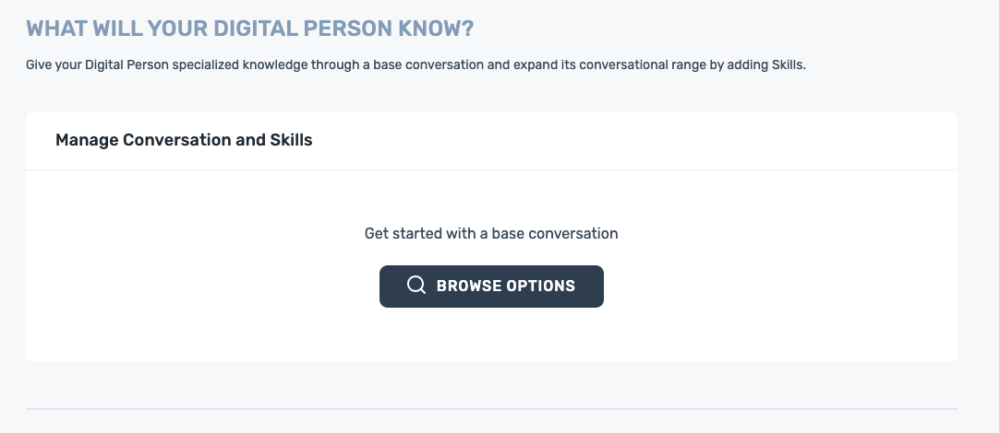
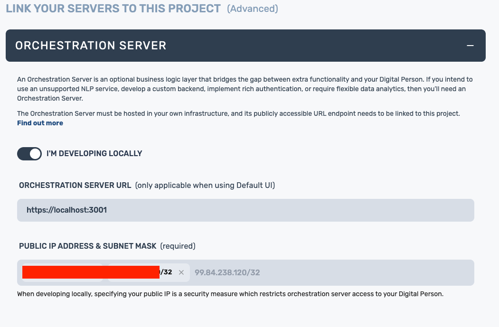
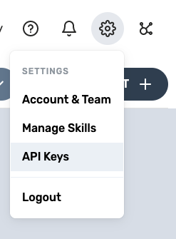
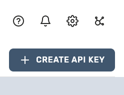
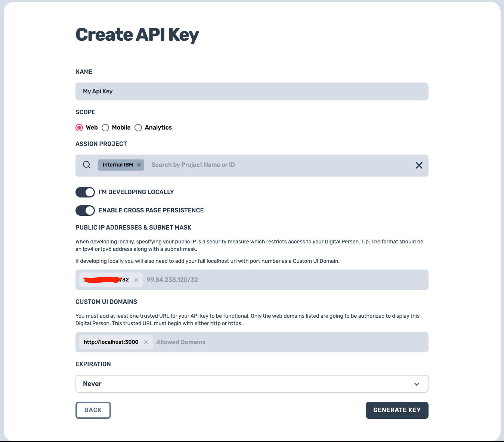
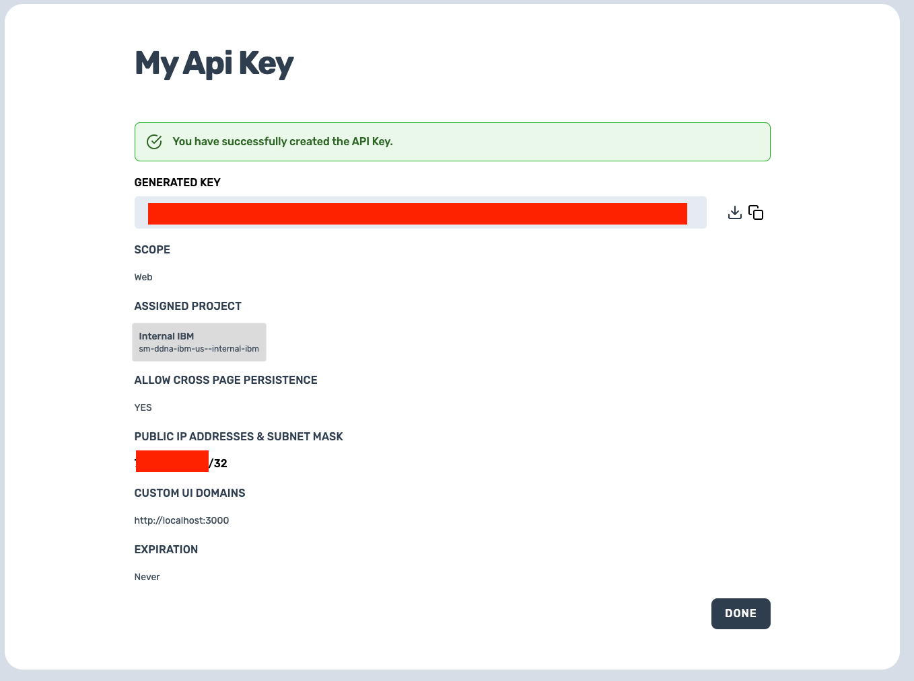

## DDNA Studio Configuration
Create your digital person before continuing.

- [DO NOT ADD YOUR ACTION TO YOUR DDNA PROJECT](#in-conversation-and-skills)
- [Link Orchestration Server](#link-orchestration-server)
- [Create API Key](#create-api-key)

---

### In Conversation and Skills
### DO NOT add your Watson Assistant!

---

### Link Orchestration Server

To use an Orchestration Server with a Digital DNA Studio deployed Digital Person, set the Conversation (NLP) Deployment option to Other in the Digital DNA Studio configuration screen (scroll to the very bottom).

Fill in the fields as required to establish the connection to your Orchestration Server.

When developing locally, it is possible to run an Orchestration Server locally for testing or debugging purposes. This requires the orchestration server URL (typically ‘https://localhost:3001’) and your public IP (try www.ipchicken.com) to be specified. Note: if you have configured your orchestration server outside of Digital DNA Studio, then leave the server URL blank and only specify your public IP.

In Production mode, developing locally is switched off and only a server URL is required (must be https or wss protocol for security).

### Create API Key
From your DDNA Studio Dashboard, go to the top right gear box and click `API Keys`.

From there, click on `Create API Key`.

Fill out all fields. Choose the project that you have created, fill in your IP with the same value you used for linking the orchestration server, set your custom UI domain to `http://localhost:3000` (when deployed, you must change that to the route you set for your UI) and click generate.

Once created, copy this API key and fill that value in the file `react-ui/.env` and variable `REACT_APP_API_KEY`.

