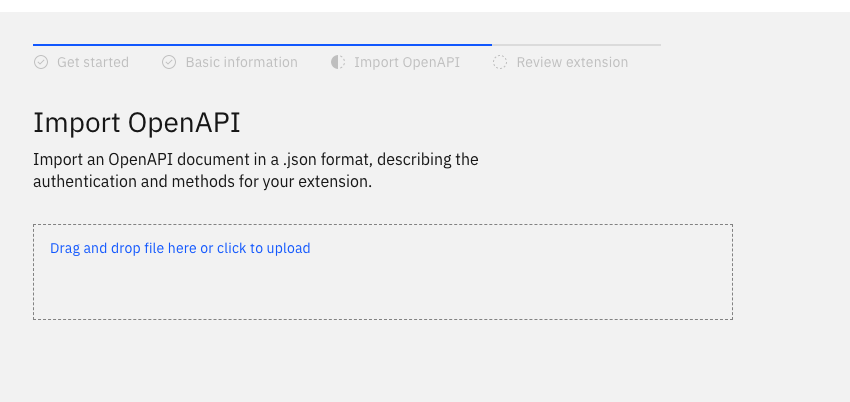

## NeuralSeek and Watson Assistant Integration


- [NeuralSeek](#neuralseek)
    - [Setup](#setup)
    - [Integrate](#integrate)
- [Watson Assistant Integration](#watson-assistant-integration)
    - [Build and setup custom extension](#build-and-setup-custom-extension)
    - [Update NeuralSeek Search Action in Assistant](#update-neuralseek-search-action-in-assistant)


### NeuralSeek

From ```ibm.cloud.com```, go to ```catelog``` and find ```NeuralSeek```.
For *presales* demonstrations, use the ```lite``` pricing plan.


Create and launch your instance. You will be taken through setup.

#### Setup
---

**Basics**

Set the company that will be the focus of the documents that have been ingested by your Watson Discovery instance. Choose whether this will be internal or customer facing.


---

**Data**

Choose ```Watson Discovery``` as the Knowledge Base Type. And then fill in the ```Discovery Service URl```, ```Discovery API Key```, and ```Discovery Project ID```. 


Hit ```Test```, and you should see a success.


---

**About**

This should prepopulate an about section based on the data in your corpus and the company name chosen in Basics.

Choose ```Watson Assistant``` and click ```Next```.


---

**Tune**

Tune NeuralSeek for your data. NS will do the tuning for you based on the way your choice and how the data is structured.


---


**Q&A**

NeuralSeek will generate and build Q&A content to bootstrap your assistant.

Click on ```Auto-Generate Questions```, after a few moments, it will provide a list which you can then submit.


--- 

#### Integrate

Go to the ```Integrate``` tab, copy the ```API Key``` and download the ```OpenApi File```.


---


### Watson Assistant Integration

#### Build and setup custom extension

From your Watson Assistant, go to the bottom left and click on the ```Integrations``` tab. Scroll to ```Extensions``` and click on the ```Build custom extension``` button.


---

Name your custom extension, and then import the ```OpenAPI``` file you had downloaded from the NeuralSeek integrate tab.



---

Review the NeuralSeek extension's routes. It should look like this:


---

Add extension and change ```Authentication type``` to ```API Key Auth```. Paste the ```API key``` you copied from the NeuralSeek integrate tab.


#### Update NeuralSeek Search Action in Assistant

In the assistant that you had uploaded from the ```watson/``` directory, there is a ```NeuralSeek Search``` action. Click on that action. Go to ```Step 3```, and click on ```Edit extension```.


Choose the NeuralSeek extension you have just created. As the ```Operation```, choose the ```Seek an answer from NeuralSeek```. Finally set the ```question``` parameter to the session variable ```query_text```.


The NeuralSeek extension is now connected to your Watson Assistant.

