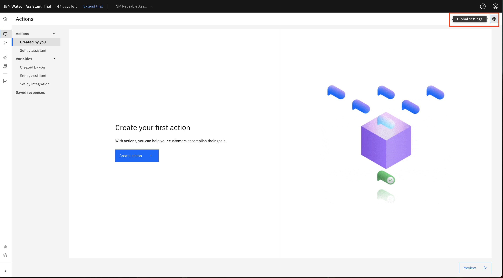
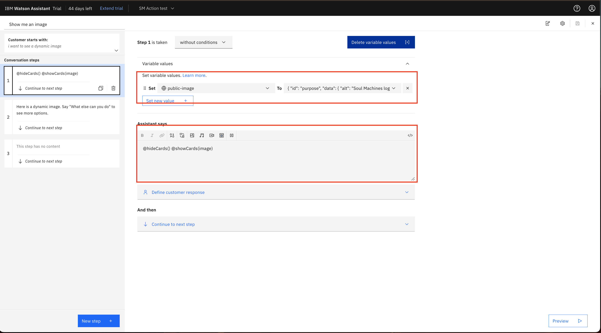

## Watson Action Setup for Integration with Soul Machines

- [Create Your Action](#create-your-action)
  1. [Upload action](#upload-action-json)
  2. [Draft Environment](#draft-environment)
- [Integrating Soul Machines Functionality](#integrating-soul-machines-functionality)
  1. [Browser Id Set](#browser-id-set)
  2. [Component Card](#rendering-components)
  3. [Multiple Component Cards in One Node](#rendering-the-same-component-type-multiple-times)

## Create Your Action

### Upload Action json

In `watson/`, there is one action.json:

- `Watson-AI-action.json`

Use this action as a base for your NeuralSeek integration.

Click global settings after creating  your assistant.



And then upload the action JSON.


<!-- Upload action image goes here -->

### Draft Environment 

Grab the Draft Environment API Key and place it in your `.env`


## Integrating Soul Machines Functionality

### Browser ID set

Ensure that the browser id session variable and card is displayed in the greet action (or whichever first action).


### Rendering Components

All components that will be displayed must follow this pattern, unless it is the same component being called in multiple times in the same action:

In the action session variables:

```
public-<component>: {"id":...}
```

Create your session variable and set the type to `any`.


The shape of the data must look like this:

```
{
  "id": "<component id>",
  "data": { ...,
  },
  "type": "<component name>"
}

```



### Rendering the Same Component type multiple times

For rendering multiple instances of the same component within one action, follow this pattern:

In the action session variables:

```
public-<dynamicName>: {"id":...}
```

For example, the Custom Component rendered in the `watson_assistant_example_action.json`


The payload in the example context variable:

```
{
  "id": "generic1",
  "data": {
    "title": "This is a Generic Card",
    "content": "The context variable was named public-generic1",
    "subtitle": "Simply pass data from Watson in a response"
  },
  "type": "generic"
}
```
