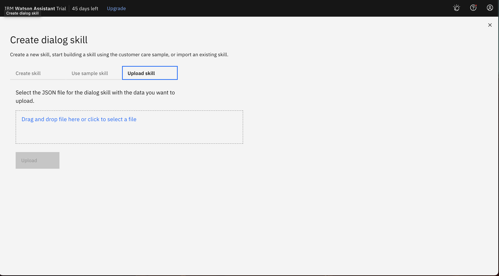
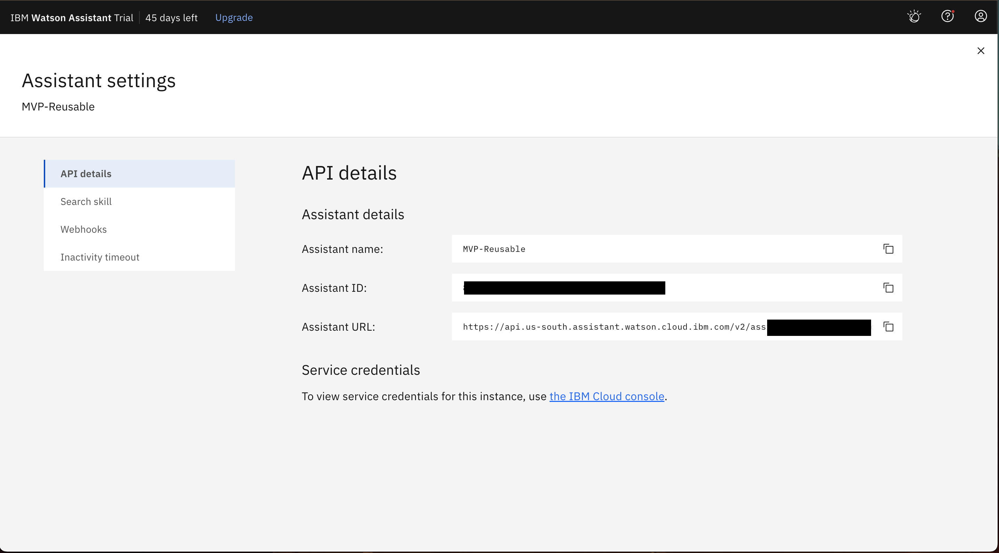
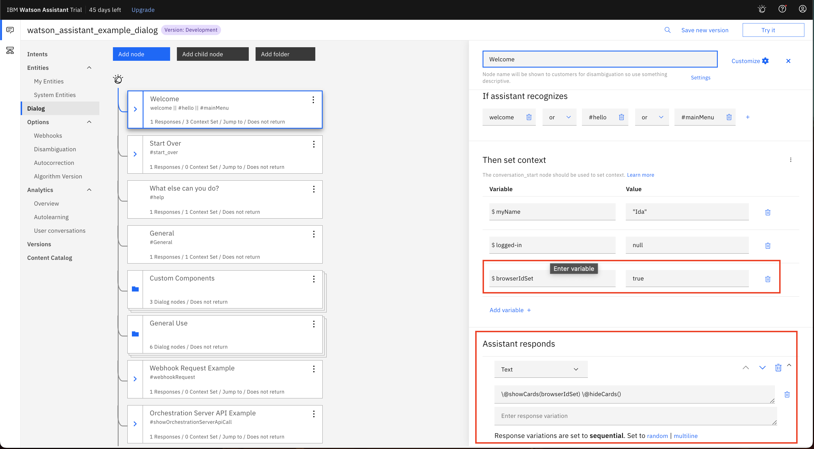
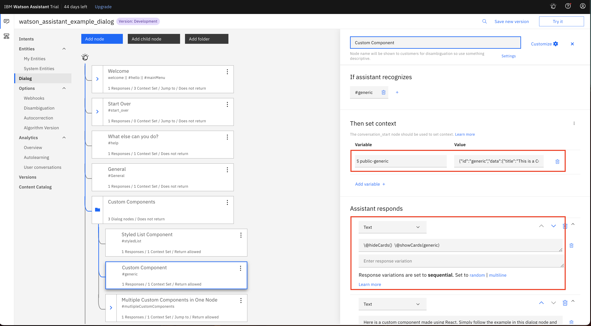
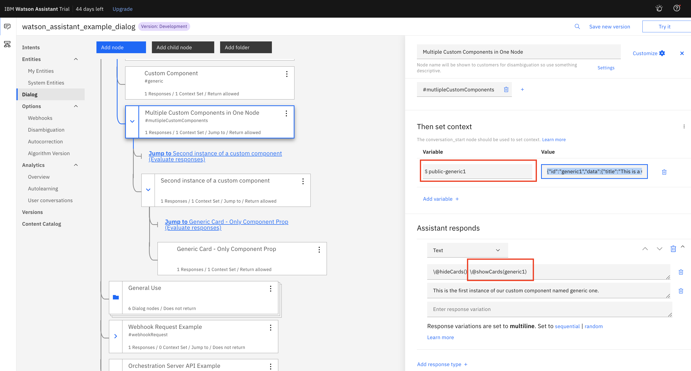

## Watson Dialog Setup for Integration with Soul Machines

- [Create Your dialog](#create-your-dialog)
  1. [Upload dialog json](#upload-dialog-json)
  2. [Add Assistant ID to your `orch-server/.env`](#assistant-id)
- [Integrating Soul Machines Functionality](#integrating-soul-machines-functionality)
  1. [Browser Id Set](#browser-id-set)
  2. [Component Card](#rendering-components)
  3. [Multiple Component Cards in One Node](#rendering-the-same-component-type-multiple-times)

## Create Your Dialog

### Upload dialog json

In `watson/`, there are 2 Watson Assistant dialog JSONs:

- `watson_assistant_starter_dialog.json`
- `watson_assistant_example_dialog.json`

The starter dialog should be used to create a custom dialog from scratch, while the example dialog is pre made with examples for functionality already available.

Choose the dialog you want to use, and upload it to Watson Assistant

<!-- Upload dialog image goes here -->



### Assistant ID

Grab the Watson Assistant ID and place it in your `.env`




## Integrating Soul Machines Functionality

### Browser ID set

Ensure that the browser id context variable and card is displayed in the welcome (or whichever first node).



### Rendering Components

All components that will be displayed must follow this pattern, unless it is the same component being called in multiple children (using jump etc.):

In the dialog context variables:

```
$public-<component>: {"id":...}
```

The shape of the data must look like this:

```
{
  "id": "<component id>",
  "data": { ...,
  },
  "type": "<component name>"
}

```



### Rendering the Same Component type multiple times

For rendering multiple instances of the same component within one dialog node, follow this pattern:

In the dialog context variables:

```
$public-<dynamicName>: {"id":...}
```

For example, the Custom Component rendered in the `watson_assistant_example_dialog.json`



The payload in the example context variable:

```
{
  "id": "generic1",
  "data": {
    "title": "This is a Generic Card",
    "content": "The context variable was named public-generic1",
    "subtitle": "Simply pass data from Watson in a response"
  },
  "type": "generic"
}
```
